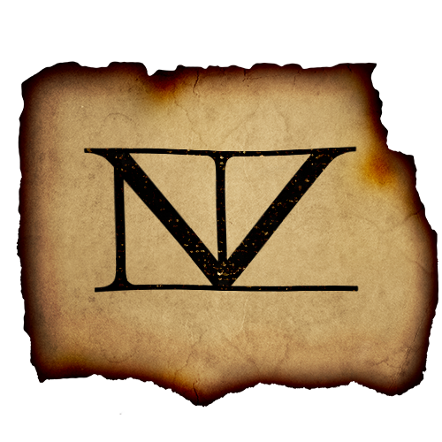

    

<h1 align="center">
  Lumberian Wiki
</h1>

## Welcome to my very own wiki

This is my simple wiki page project, where I'm using GatsbyJS as my framework.

The purpose of the project is for me to learn React and a web framework, and exploring the lands of web development. Also, in part, it is to make a platform for me to store my (hopefully) expanding library of texts and notes concerning the self-created finctional fantasy universe surrounding the continent of Lumberia.

For now the articles are few, but my ideas have been cooking in my mind for years. The plan is to expand the website when my artistic creativity is lacking, and to expand my universe when my technical creativity is low.
